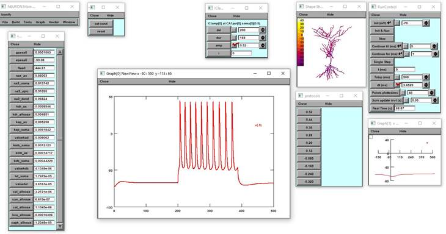

Model files in the NEURON simulation environment (v7.7) from the paper

 

**"Different responses of mice and rats hippocampus CA1 pyramidal neurons to in vitro and in vivo-like inputs"**

 

by Paola Vitale, Fabio Librizzi, Andrea C. Vaiana, Elisa Capuana, Maurizio Pezzoli, Ying Shi, Armando Romani, Michele Migliore and Rosanna Migliore 

*Frontiers in Cellular Neuroscience*, 2023

**DOI:** [10.3389/fncel.2023.1281932](https://doi.org/10.3389/fncel.2023.1281932)

Usage:

- Compile the mod files with `mknrndll` (mswin or graphical mac) or `nrnivmodl` (unix/linux).

- Start the simulation by (unix/linux) typing on the command line: `nrngui Figure3D.hoc` or (mac os x) drag and dropping the `Figure3D.hoc` file on the `nrngui` icon or (mswin) double clicking on the `Figure3D.hoc` file.

- After selecting the experimental trace (on ''exp'' panel) and the corresponding phenotype (on ''model'' panel), simulation will reproduce the traces in Figure 3D of the paper.

- To test more parameters the user should could also handling the ''values'' panel and perform his own simulation.

 

Example: clicking on protocol "0.52" and running the simulation the window should produce the following graph:

